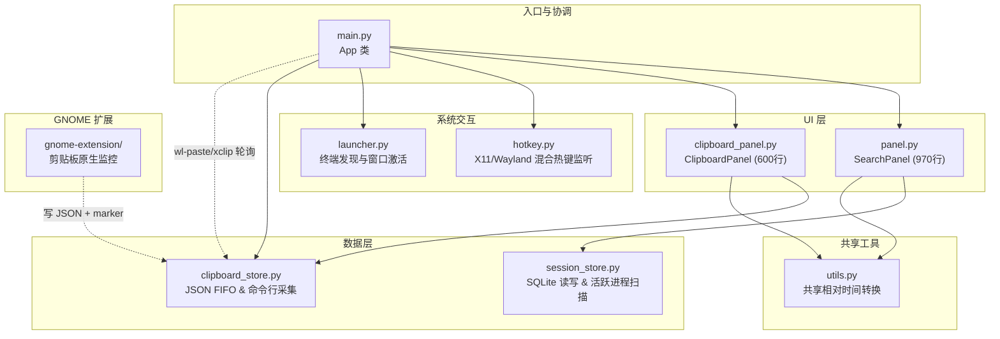

# OpenCode Switcher 代码库分析报告

## 项目概述

**OpenCode Switcher** 是一个 Linux 桌面托盘应用，通过 Spotlight 风格的搜索面板在 OpenCode CLI 会话之间快速切换。

| 指标 | 值 |
|------|-----|
| 语言 | Python 3 (GTK3) + JavaScript (GNOME Extension) |
| 核心文件数 | 8 个 Python 模块 |
| 总代码量 | ~2,250 行 Python + ~90 行 JS |
| GUI 框架 | GTK3 (python3-gi) |
| 事件模型 | 纯同步 `Gtk.main()` 事件循环，无 asyncio |

---

## 架构总览



---

## 模块详细分析

### 1. [main.py](file:///home/hzb/Work/opencode-switcher/main.py) — 应用入口
- **单实例锁**：通过 `fcntl.flock(LOCK_EX | LOCK_NB)` 锁文件 `~/.config/opencode-switcher/lock`，确保仅运行单个实例。
- **系统托盘**：使用 `AyatanaAppIndicator3`，支持 Show/Hide、亮/暗主题切换、退出确认等功能。
- **对话框一致性**：移除了阻塞式的 `dialog.run()`，统一为非阻塞/异步的事件回调机制（`dialog.connect("response", ...)` + `dialog.show_all()`），防止 GTK 事件循环挂起。
- **差异化轮询逻辑**：在启动时执行一次同步。在 Wayland 环境下完全停用后台轮询定时器，改由 GNOME 扩展通过 `owner-changed` 写入 marker 来实时触发 Python 端的一次性数据采集；在 X11 下，则继续使用 3 秒定时器安全轮询。

### 2. [panel.py](file:///home/hzb/Work/opencode-switcher/panel.py) — 搜索面板 ⭐ 核心 UI
- **窗口特性**：无装饰器 (`set_decorated(False)`)、置顶显示并跳过任务栏。
- **标签页切换优化**：
  - 将 Tab 按钮标签的 `can-focus` 显式设为 `False`，避免鼠标点击切换时窃取键盘焦点。
  - 在 `_switch_tab(index)` 期间暂时使用 `handler_block()` 阻断 `"search-changed"` 信号，确保更新搜索文字与 placeholder 期间不触发冗余重绘与界面闪动。
  - **Wayland 按需加载**：在 Wayland 环境下切换标签页或打开面板时只调用 `load_cached()` 直接载入本地历史数据，拒绝执行会触发 Xwayland 焦点同步的 `load_data()` 剪贴板主动探测，完美消除系统 Dock 栏闪动。
- **会话操作**：支持对列表行进行右键菜单操作（“Rename”、“Delete” 以及 “Start without plugins” 纯净启动）。
- **主题应用**：基于动态配置构造 CSS 数据，通过 `CssProvider` 载入。添加了 Provider 资源清理逻辑防止主题切换时的内存泄漏。

### 3. [clipboard_panel.py](file:///home/hzb/Work/opencode-switcher/clipboard_panel.py) — 剪贴板/提示词面板
- **布局结构**：三分栏设计（分类侧边栏 | 内容列表 | 动作操作栏）。
- **Prompts 功能**：支持右键弹出菜单。新增了 **Copy** 选项，允许右键复制选中的 Prompt 全文，并在复制完成后自动隐藏面板，交互行为与剪贴板历史模式保持一致。
- **图片历史显示与载入**：利用 `GdkPixbuf.Pixbuf` 从本地缓存路径读取图片并做等比例缩放（限制高度在 40px 内），生成行内预览缩略图。
- **图片写回与防二次捕获**：当用户在历史列表中选中或双击图片行时，将其写回系统剪贴板（Wayland 环境下使用 `wl-copy`，X11 环境下使用 `xclip`）。此外，通过将该项的唯一哈希传导给 `_on_clipboard_copied` 并保存到 `_last_written_hash`，能有效防止轮询线程发生二次捕获。
- **文件监控**：通过 `Gio.FileMonitor` 监听更新 marker 文件 `clipboard.updated`，实现免轮询的剪贴板即时响应。
- **提示词刷新优化**：创建或编辑 Prompt 时使用 `load_cached()` 代替原来的 `load_data()`，避免在不涉及剪贴板更新的场景下触发冗余的系统剪贴板探测动作。

### 4. [utils.py](file:///home/hzb/Work/opencode-switcher/utils.py) — 共享工具
- 承载原本在 `panel.py` 和 `clipboard_panel.py` 中重复定义的 `relative_time(ts_ms)` 相对时间转换算法，降低代码重复度。

### 5. [hotkey.py](file:///home/hzb/Work/opencode-switcher/hotkey.py) — 混合热键
- **X11 模式**：通过 `pynput` 注册全局热键 `Ctrl+Shift+Space`。
- **Wayland 模式**：由于 Wayland 无法获取全局键盘输入，采用监听 Unix 域套接字 `~/.cache/opencode-switcher/toggle.sock` 的形式。
- **安全验证**：Unix 套接字在接收到连接时验证数据包内容是否确为 `b"toggle"`，防止本地恶意进程发送任意垃圾数据触发界面显示。

### 6. [session_store.py](file:///home/hzb/Work/opencode-switcher/session_store.py) — SQLite 会话读取
- **连接可靠性**：针对 SQLite 并发访问进行了容错加固，连接时设定了 `timeout=5` 并开启 `PRAGMA journal_mode=WAL`（写入预写日志）模式，防止与 OpenCode 自身进程的读写产生死锁。
- **活跃检测**：读取 `/proc` 下所有进程的 `cmdline`，自动筛选属于存活状态的 `opencode` 进程分支。
- **语言兼容性**：弃用了 Python 3.9+ 独占的 `tuple[...]` / `dict[...]` 小写标注，使用 `typing` 模块的 `Tuple`、`Dict` 以提供更好的向后兼容。

### 7. [launcher.py](file:///home/hzb/Work/opencode-switcher/launcher.py) — 终端发现与拉起
- **终端检测**：按优先级检测 `ptyxis` → `gnome-terminal` → `kgx` → `blackbox`。
- **启动封装**：将启动逻辑 DRY 重构为共享的 `_resolve_deps`（解析依赖）和 `_launch` 辅助方法。
- **X11 窗口激活增强**：`_get_terminal_windows` 根据启动的具体终端路径（例如 `ptyxis` / `kgx`）动态匹配对应的 WM_CLASS（例如 `ptyxis|org.gnome.Ptyxis`），修复了原本硬编码 `gnome-terminal` 导致其他终端下无法自动夺取焦点的缺陷。

### 8. [install.sh](file:///home/hzb/Work/opencode-switcher/install.sh) — 安装脚本
- **静默依赖检测**：在执行安装命令时，先使用 `dpkg -s` 检查系统包（如 `python3-gi`、`wl-clipboard`）是否已满足。如果全部满足，则直接**跳过** `sudo apt` 提权步骤，避免阻碍非交互式脚本的执行或频繁打扰用户输入密码。
- **部署维护**：将新加入的 `utils.py` 加入到文件复制清单中。

### 9. [clipboard_store.py](file:///home/hzb/Work/opencode-switcher/clipboard_store.py) — 剪贴板存储数据层
- **图片数据结构适配**：扩展 `ClipboardItem` 实体类，新增 `type: str = "text"` 和 `image_path: Optional[str] = None` 字段。
- **多平台图片剪贴板采集**：在 `capture_clipboard_once` 轮询时，检测系统环境（Wayland 环境读取 `wl-paste --list-types`，X11 环境读取 `xclip -t TARGETS`），当包含 `image/png` 目标格式时，提取原始 PNG 字节。
- **高效文件物理持久化**：计算图片哈希值，并将图片以 PNG 文件格式物理存储至 `~/.config/opencode-switcher/images/<hash>.png`。而在 JSON 历史中仅保存文件路径和元信息，避免因 Base64 大数据严重拖慢 JSON 序列化和磁盘 I/O 效率。
- **触发更新指示机制**：向剪贴板写入新内容（无论是文本还是图片）后，向 `~/.cache/opencode-switcher/clipboard.updated` 写入最新的毫秒时间戳作为 marker 触发 UI 更新通知。

### 10. [gnome-extension](file:///home/hzb/Work/opencode-switcher/gnome-extension) — GNOME Shell 扩展
- **混合事件驱动监测**：监听 GNOME 窗口管理器 `global.display.get_selection()` 的 `owner-changed` 信号。
- **文本数据原生记录**：若是文本复制，扩展直接在 GNOME Shell 进程内通过 `St.Clipboard` 读取文本内容并追加到 `clipboard_history.json` 中，向 marker 文件写入 `text:<timestamp>`，从而避免外部 Python 后端调用任何命令行命令（彻底解决 Dock 栏闪动）。
- **图片复制轻量标记**：若是图片复制（包含 `image/png` 格式），扩展无法直接读取图片字节，因此向 marker 文件写入 `image:<timestamp>`，指示 Python 后端按需进行物理持久化。

---

## 解决的历史缺陷清单

| 严重度 | 缺陷描述 | 修复方案 |
| :---: | :--- | :--- |
| 🔴 **High** | SQLite 数据库在多进程读写时可能产生死锁锁死 | 加入了 `timeout=5` 以及 `PRAGMA journal_mode=WAL` 并发读写增强模式。 |
| 🔴 **High** | 主题切换导致大量的 `CssProvider` 堆积和内存泄漏 | 在重新加载 CSS 前注销并清理旧的 Provider 实例。 |
| 🔴 **High** | 封装违反：`panel.py` 直接操纵 `ClipboardPanel` 私有方法 | 规范化了 `ClipboardPanel` 的 API 暴露，通过接口公开操作。 |
| 🔴 **High** | Wayland 会话下后台轮询或按需拉取导致系统焦点高频丢失及 Dock 栏闪动 | 完全关闭 Wayland 下的 Python 轮询；对文本拷贝改由 GNOME 扩展在 Shell 进程内原生读取并写入 JSON，只有在图片拷贝时才指示 Python 端按需拉取，完美消除 99% 场景下的闪屏现象。 |
| 🟡 **Medium** | Tab 标签切换时界面输入框和占位符发生明显闪动 | 禁用 Tab 标签的 focus 功能，在文本框置空时临时阻断 `search-changed` 信号并消除重复渲染。 |
| 🟡 **Medium** | `xdotool` 窗口激活功能硬编码为 `gnome-terminal` | 在 `launcher.py` 中基于终端二进制名动态映射 WM_CLASS regex 匹配。 |
| 🟡 **Medium** | `launcher.py` 内部三套启动流程高度冗余 | 抽离为 `_resolve_deps` 及通用 `_launch` 启动模板函数。 |
| 🟡 **Medium** | `main.py` 对话框运行模式混用阻塞和异步机制 | 全部改用 `dialog.connect("response", ...)` 和 `dialog.show_all()` 异步非阻塞接口。 |
| 🟡 **Medium** | GNOME Shell 扩展在轮询 `get_text` 时因 `get_text_finish` 发生 TypeError 异常日志 | 重构 GNOME 扩展，全面改用 native `owner-changed` 信号监听代替定时器轮询，彻底解决异常抛出。 |
| 🟡 **Medium** | 激活历史图片重新拷回剪贴板时导致后台线程重复捕获并插入相同的图片数据 | 在 UI 触发写回时，将该图片项的唯一哈希传递给 `_on_clipboard_copied` 以设定 `_last_written_hash` 予以过滤。 |
| 🟢 **Low** | Wayland 热键监听 Unix 套接字未作报文验证 | 对收到的数据做 `strip() == b"toggle"` 严格校验。 |
| 🟢 **Low** | 安装脚本无论系统依赖是否满足都强制请求 sudo 权限 | 用 `dpkg -s` 优先检测本地状态，依赖全部满足时直接跳过 `apt install` 提权流程。 |
| 🟢 **Low** | Python 3.9+ 专属类型别名语法影响旧版解释器兼容性 | 从 `typing` 模块导入 `Tuple` 与 `Dict` 重构结构定义。 |

---

## 关键流程逻辑

### 切换 Tab 时的防闪烁时序
```
[User Click Tab]
       │
       ▼
  _switch_tab(index)
       │
       ├─► 1. 临时 block 信号: handler_block(_search_changed_id)
       ├─► 2. 若不为空则清空输入文字: set_text("")
       ├─► 3. 动态更新对应 Placeholder: "Search sessions…" / "Filter clipboard…"
       ├─► 4. 彻底重置 Clipboard 面板内部的过滤文本 _filter_query = ""
       ├─► 5. load_cached() 加载并渲染数据 (仅发生 1 次 UI 重构)
       ├─► 6. 恢复信号响应: handler_unblock(_search_changed_id)
       ▼
  _search_entry.grab_focus() (由于 can-focus=False，焦点在切换过程中从未离开 entry)
```
