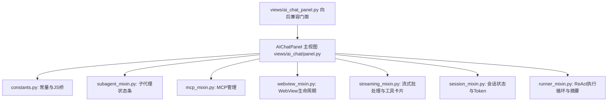

# AI Chat Panel 模块化拆分实施计划 (阶段二)

本文档制定了将代码库中最庞大的核心巨兽单体文件 `views/ai_chat_panel.py`（5,221 行）分步重构为模块化包 `views/ai_chat/` 的完整方案。为确保系统稳定性与高内聚，本方案采取**低风险到高风险逐级分步推进**的策略。

---

## 一、 改动点全量梳理与目标架构

### 1. 新增与修改文件清单

| 文件路径 | 风险等级 | 预计行数 | 核心职责说明 |
|:---|:---:|:---:|:---|
| [`views/ai_chat/constants.py`](file:///home/hzb/opencode-switcher/views/ai_chat/constants.py) | **🟢 极低** | ~180 行 | 常量定义、Prompt/Template 正则、Token 计数参数、Header JS 兼容桥对象 |
| [`views/ai_chat/subagent_mixin.py`](file:///home/hzb/opencode-switcher/views/ai_chat/subagent_mixin.py) | **🟢 低** | ~220 行 | 子代理（Sub-agent）状态轮询、FlowBox 状态栏动态渲染与闪烁消除防护 |
| [`views/ai_chat/mcp_mixin.py`](file:///home/hzb/opencode-switcher/views/ai_chat/mcp_mixin.py) | **🟡 中低** | ~200 行 | MCP 客户端生命周期、连接池管理、工具刷新与动态响应监听 |
| [`views/ai_chat/webview_mixin.py`](file:///home/hzb/opencode-switcher/views/ai_chat/webview_mixin.py) | **🟡 中** | ~650 行 | WebKit WebView 创建、进程崩溃恢复、内存压力控制、60s 挂起/唤醒、Scheme 路由 |
| [`views/ai_chat/streaming_mixin.py`](file:///home/hzb/opencode-switcher/views/ai_chat/streaming_mixin.py) | **🟡 中** | ~450 行 | 60ms Token/Reasoning 批处理缓冲、流式容器 DOM 状态机、工具卡片增量更新 |
| [`views/ai_chat/session_mixin.py`](file:///home/hzb/opencode-switcher/views/ai_chat/session_mixin.py) | **🟠 中高** | ~750 行 | 会话 CRUD、Fork 分支克隆、系统提示词快照、Token 计数显示、历史会话切换 |
| [`views/ai_chat/runner_mixin.py`](file:///home/hzb/opencode-switcher/views/ai_chat/runner_mixin.py) | **🔴 高** | ~1100 行 | LLM 请求装配、ReAct 工具循环调度、多轮流式中断/恢复、自动生成标题与摘要压缩 |
| [`views/ai_chat/panel.py`](file:///home/hzb/opencode-switcher/views/ai_chat/panel.py) | **🟡 中** | ~1600 行 | `AIChatPanel` 顶层 GTK 容器拼装、底部输入框、斜杠命令调度、键盘热键与生命周期 |
| [`views/ai_chat/__init__.py`](file:///home/hzb/opencode-switcher/views/ai_chat/__init__.py) | **🟢 极低** | ~30 行 | 包统一导出接口，暴露 `AIChatPanel` 与所有公共辅助工具函数 |
| [`views/ai_chat_panel.py`](file:///home/hzb/opencode-switcher/views/ai_chat_panel.py) | **🟢 极低** | ~35 行 | 100% 向后兼容门面（Facade），重定向至 `views.ai_chat` |

---

### 2. 详细子模块职责划分与依赖关系

#### (1) `views/ai_chat/constants.py` (极低风险)
- 包含：`TEMPLATE_REGEX`, `PROMPT_PLACEHOLDER_RE`, `_MPS_*`, `AI_BTN_LABEL_*`, `_AI_HEADER_TITLE`；
- 包含：`_to_chat_messages`, `_ai_stream_request_key`, `_ai_summary_request_key`, `_webview_shell_fingerprint`, `_should_full_reload_webview`；
- 包含：`_WebViewBridgeBase`, `_HeaderSpinnerBridge`, `_HeaderTitleBridge`, `_HistoryPopoverBridge`。

#### (2) `views/ai_chat/subagent_mixin.py` (低风险)
- 包含：`_init_subagent_status_bar`, `_update_subagent_status_bar`, `_poll_subagents`, `_render_subagent_item`；
- 特性：解耦 FlowBox 状态栏动态渲染与 CSS class `.subagent-status-bar` 闪烁防护。

#### (3) `views/ai_chat/mcp_mixin.py` (中低风险)
- 包含：`_init_mcp`, `_on_mcp_server_tools_changed`, `_load_and_connect_mcp_servers`, `_refresh_mcp_tools`, `_on_mcp_tools_ready`, `_reconfigure_mcp`；
- 特性：解耦 MCP 客户端异步连接、动态工具列表刷新与事件订阅。

#### (4) `views/ai_chat/webview_mixin.py` (中风险)
- 包含：`_init_webview`, `_apply_webview_gtk_background`, `_on_webview_crashed`, `_on_ai_suspend_timeout`, `_scroll_to_bottom`, `_scroll_to_top`, `_on_navigation_decision`, `_render_markdown`；
- 特性：严格维护 WebKit 内存优化模式、60s 延迟挂起、WebProcess 进程管理与 DOM 就绪状态。

#### (5) `views/ai_chat/streaming_mixin.py` (中风险)
- 包含：`_init_streaming_state`, `_active_stream_req_id`, `_ensure_streaming_container`, `_on_token_delta`, `_flush_token_buffer`, `_on_reasoning_delta`, `_flush_reasoning_buffer`, `_on_tool_calls_started`, `_on_tool_result`, `_show_tool_details`；
- 特性：维护 60ms Python Token 缓冲、Reasoning 增量与 DOM 局部卡片增量注入。

#### (6) `views/ai_chat/session_mixin.py` (中高风险)
- 包含：`_start_new_conversation`, `_switch_conversation`, `_delete_conversation`, `_fork_conversation`, `_snapshot_system_prompt`, `_update_token_count_display`, `_estimate_tokens_fast`, `_truncate_messages_if_needed`；
- 特性：维护会话 CRUD、Fork 快照隔离与 Token 计数器。

#### (7) `views/ai_chat/runner_mixin.py` (高风险)
- 包含：`_run_llm_api_request`, `ask_llm_api`, `_send_user_message`, `_retry_response`, `_generate_title_async`, `_generate_summary_async`, `_cancel_streams_for_conversation`；
- 特性：ReAct 工具循环调度核心、看门狗超时监控、后台会话状态同步与摘要生成。

#### (8) `views/ai_chat/panel.py` 与 `__init__.py`
- `AIChatPanel` 继承所有 Mixin，装配 UI 布局组件、输入框文本处理、斜杠命令调度与键盘事件；
- `views/ai_chat_panel.py` 导出全部符号，保证 692 个测试无缝运行。

---

## 二、 风险分级分步执行计划 (Multi-Step Execution Roadmap)

### 📌 Step 1: 基础设施与数据桥接提取 (Phase 2.1 — Low Risk)
1. 创建 `views/ai_chat/` 目录；
2. 提取并创建 `views/ai_chat/constants.py`；
3. 单元测试验证（确保导入正常）。

### 📌 Step 2: 外部集成提取 (Phase 2.2 — Low-Medium Risk)
1. 提取并创建 `views/ai_chat/subagent_mixin.py`；
2. 提取并创建 `views/ai_chat/mcp_mixin.py`；
3. 单元测试验证（`test_subagent_monitoring.py`, `test_mcp_phase3.py` 等）。

### 📌 Step 3: WebView 与流式渲染提取 (Phase 2.3 — Medium Risk)
1. 提取并创建 `views/ai_chat/webview_mixin.py`；
2. 提取并创建 `views/ai_chat/streaming_mixin.py`；
3. 单元测试验证（`test_ai_token_batching.py`, `test_ai_html_generation.py` 等）。

### 📌 Step 4: 会话状态机与 LLM 执行循环提取 (Phase 2.4 — Medium-High Risk)
1. 提取并创建 `views/ai_chat/session_mixin.py`；
2. 提取并创建 `views/ai_chat/runner_mixin.py`；
3. 单元测试验证（`test_ai_request_cancellation.py`, `test_system_prompt.py`, `test_ai_delete_active_conversation.py` 等）。

### 📌 Step 5: 主视图组装与门面桥接 (Phase 2.5 — Integration & Facade)
1. 创建 `views/ai_chat/panel.py`（多继承 Mixin，构建 UI 结构）；
2. 创建 `views/ai_chat/__init__.py`；
3. 重写 `views/ai_chat_panel.py` 为薄 Facade；
4. 全量 692+ 单元测试完整回归。

---

## 三、 风险与质量保障机制

1. **测试驱动安全验证**：
   每一步迁移后均运行针对性测试与全量测试套件，在发现任何断言失败时能够立即定位至单一子模块。
2. **方法签名与属性完全对齐**：
   所有 Mixin 中的 `self._ai_*` 属性与方法名保持 100% 一致，测试用例通过 `AIChatPanel.__new__(AIChatPanel)` 构建假对象调用的未绑定方法完全不受影响。
3. **GTK 线程与 C 内存安全**：
   严格遵循 `AGENTS.md` 规则，UI 异步更新统一使用 `GLib.idle_add`，WebView 销毁前解除所有信号。
