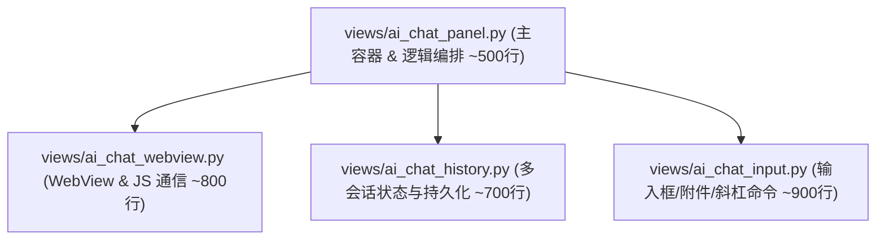

# 实施计划 — 拆分大型单文件 `views/ai_chat_panel.py` (阶段 1)

## 一、 改动点梳理与模块依赖图

`views/ai_chat_panel.py` 当前体量约 4030 行（包含 121 个类方法），集成了 UI 布局、WebKit2 WebView 通信、输入框附件解析、多会话历史缓存、ReAct 工具循环路由与线程调度。

本方案将其解耦拆分为 4 个职责单一的高内聚模块：

---

### 1.1 需修改与新增的文件清单

| 模块 filepath | 文件状态 | 核心职责 | 潜在影响与防错 |
|--------------|---------|---------|---------------|
| `views/ai_chat_webview.py` | **新增** | WebKit2 WebView 初始化、`MemoryPressureSettings` 内存管理、`on_decide_policy` 复制/卡片折叠拦截、JavaScript 执行、`terminate_web_process` 安全挂起。 | 继承 `Gtk.Box`，需确保 WebKit2 崩溃重连与不透明背景色还原逻辑完整。 |
| `views/ai_chat_history.py` | **新增** | 管理 `_ai_running_convs` 多会话并发状态、`ConversationStore` 读写、历史下钻与滚动分段加载、标题自动生成与上下文自动裁剪。 | 无 GTK 强耦合，状态必须线程安全（使用 `GLib.idle_add`）。 |
| `views/ai_chat_input.py` | **新增** | 多行 `Gtk.TextView` 输入框、图片/文件拖拽与剪贴板图片粘贴（`_do_capture_clipboard_image`）、附件预览栏、斜杠指令（`/skill`, `/summary`）解析与弹窗补全。 | 包含焦点守护与按键事件拦截（`Shift+Enter` 换行 vs `Enter` 发送）。 |
| `views/ai_chat_panel.py` | **重构瘦身** | 主容器 `AIChatPanel`，实例化并组合上述组件；路由 ReAct 工具循环（`run_llm_react_loop`）；对外暴露 `toggle_ai` / `set_theme` / `load_sessions` 等标准接口。 | 保持现有 `AIChatPanel` 类签名与对外 API 100% 兼容。 |
| `views/__init__.py` | **修改** | 导出 `AIChatPanel` 及子组件。 | 保持包导入兼容。 |

---

## 二、 详细实施计划

### 步骤 1：创建 `views/ai_chat_webview.py`
- **目标**：提取 WebKit2 WebView 初始化与 JS 通信层。
- **关键代码/函数**：
  - 转移 `_build_webview()`、`_on_decide_policy()`、`eval_js()`、`terminate_web_process()`、`reset_webview_state()`。
  - 构造函数传入 `theme_name`, `on_copy_to_clipboard_cb`, `on_toggle_details_cb`。
- **风险与回退**：WebView 进程终止（`terminate_web_process`）后背景变为透明，必须重置透明度色值。

### 步骤 2：创建 `views/ai_chat_history.py`
- **目标**：提取多会话并发状态与 `ConversationStore` 持久化逻辑。
- **关键代码/函数**：
  - 管理 `self.running_convs: Dict[str, Dict[str, Any]]`。
  - 转移 `load_conversation(conv_id)`、`save_conversation()`、`trim_target` 裁剪计算、自动生成会话标题 `_generate_conversation_title()`。
- **风险与回退**：多会话后台流式接收时，避免隐藏面板导致正在运行的 `conv_id` 状态丢失。

### 步骤 3：创建 `views/ai_chat_input.py`
- **目标**：提取输入框、附件栏与斜杠指令。
- **关键代码/函数**：
  - 组装 `Gtk.TextView`、图片预览缩略图 `_ai_attachment_bar`。
  - 转移拖拽处理 `_on_ai_entry_drag_data_received`、剪贴板图片提取 `_do_capture_clipboard_image`。
  - 转移指令解析 `_handle_skill_command`、`/summary` 解析与 `AICommandPopover` 自动补全。
- **风险与回退**：输入框按键拦截中，必须防止删除已聚焦的输入控件导致 GTK C-level 信号段错误。

### 步骤 4：重构主文件 `views/ai_chat_panel.py`
- **目标**：将主文件瘦身至 ~500 行，通过组合子组件提供统一对外接口。
- **关键改动**：
  - 在 `__init__` 中实例化 `AIChatWebView`、`AIChatHistoryManager`、`AIChatInputArea`。
  - 保留并简化的核心方法：`send_user_message()`、`_run_llm_api_request()`、`set_theme()`、`toggle_ai()`。
- **风险与回退**：运行 74 项单元测试，确保主入口 `main.py` 启动正常。

### 步骤 5：回归测试与验证
- **目标**：运行全量单元测试套件，并手动验证 AI 聊天、工具调用与附件粘贴。

---

## 三、 回退与防护策略

1. **分支保护**：全程在开发分支 `refactor/modular-subpackages` 上操作，严禁直接 commit 到 `master`。
2. **测试守卫**：每次改动后必须运行 `venv/bin/python3 -m unittest discover tests` 确保 74/74 项测试 100% 通过。
