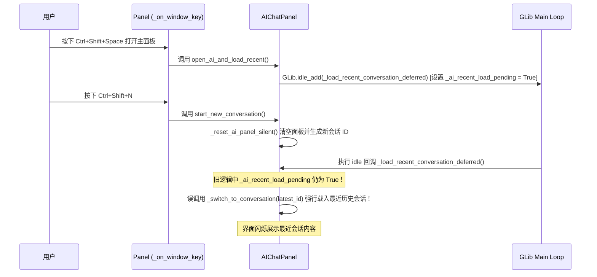

# Ctrl+Shift+N 新建会话 UI 闪烁分析与修复计划

## 1. 问题现象

当通过热键 `Ctrl+Shift+Space` 打开主面板，然后立即按下 `Ctrl+Shift+N` 新建对话时，AI 对话框会短暂闪烁显示时间上最近的一个历史会话内容，随后才清空面板开启全新的空白对话。

---

## 2. 根因追溯与代码执行流程分析

### 2.1 触发流程链

### 2.2 根本原因 (Root Cause)

1. **延迟加载任务未撤销**：`open_ai_and_load_recent()` 在首帧绘制时通过 `GLib.idle_add(_load_recent_conversation_deferred)` 将“加载最近会话”推入 GLib 主事件循环的空闲队列，并设置标志位 `_ai_recent_load_pending = True`。
2. **状态未关断**：当用户随后触发 `start_new_conversation()` （或 `_switch_to_conversation`）时，`_ai_recent_load_pending` **没有被重置为 `False`**。
3. **竞态插队覆盖**：`start_new_conversation()` 清空面板并建立了空白新会话 ID 后，GLib 主循环在下一帧执行了队列中的 `_load_recent_conversation_deferred()`，因 `latest_id != _ai_conversation_id` 成立，误调用 `_switch_to_conversation(latest_id)` 将最近的历史会话覆盖渲染到了刚新建的空白面板上！

---

## 3. 修复方案

1. **主控开关关断**：
   - 在 `start_new_conversation()` 和 `_switch_to_conversation()` 的入口处，显式设置 `self._ai_recent_load_pending = False`，主动中断任何处于等待队列中的延迟加载任务。
2. **回调防线守卫**：
   - 在 `_load_recent_conversation_deferred()` 入口处增加关断断言：若 `not getattr(self, "_ai_recent_load_pending", False)`，直接返回 `False`，跳过任何历史会话的加载与渲染。
3. **自动化测试防护**：
   - 增加回归测试 `tests/test_new_conversation_flicker.py`，模拟空闲队列竞态，确保新建会话后延迟加载任务被 100% 撤销。

---

## 4. 验证方法

- 运行 `venv/bin/python3 -m unittest discover tests` 确保全量 532 项测试 PASS。
